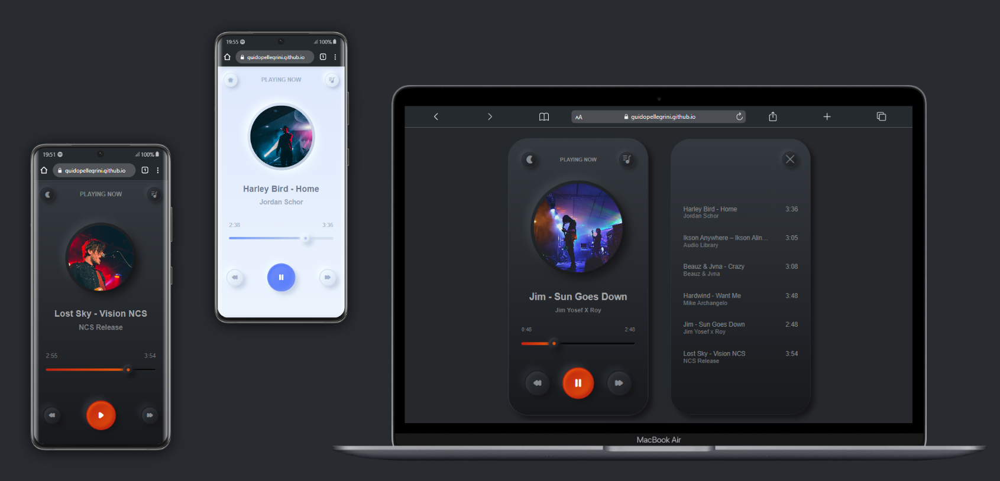

# Responsive Music Player

## Description

Welcome to the Responsive Music Player, a fictional and innovative product that pushes the boundaries of mobile technology. This music player is designed to be responsive and work on any device, from desktops to tablets to mobile phones.

## Technologies Used

- **HTML:** Provides the structure and layout of the page.
- **CSS:** Styles the page, making it visually appealing and consistent.
- **JavaScript:** Adds interactivity and dynamic behavior to the page.

## Live

https://guidopellegrini.github.io/responsive-music-player/

## Preview

